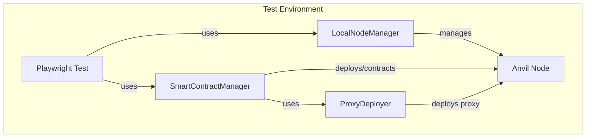
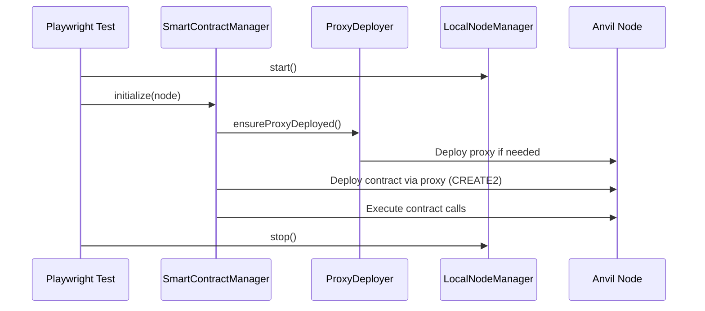

# Smart Contract Manager

> **Package:** [`@coinbase/onchaintestkit`](https://www.npmjs.com/package/@coinbase/onchaintestkit)

---

## Overview

The smart contract manager in `@coinbase/onchaintestkit` provide a robust, deterministic, and high-performance framework for deploying and interacting with Ethereum smart contracts in end-to-end (E2E) testing environments. These utilities are designed for use with local Ethereum nodes (e.g., Anvil), and leverage the [viem](https://viem.sh/) library for fast, type-safe blockchain interactions.

Key features include:

- **Deterministic Contract Deployment:** Deploy contracts at predictable addresses using the CREATE2 opcode and a deterministic deployment proxy.
- **Automated Proxy Management:** Ensure the deterministic deployment proxy is present and deployed as needed.
- **Contract State Management:** Deploy contracts and execute function calls as part of test setup, supporting complex test scenarios.
- **Parallel Test Safety:** Designed to work with the `LocalNodeManager` for parallel test execution, ensuring isolated and reproducible blockchain state.
- **Artifact Integration:** Loads contract ABIs and bytecode directly from Foundry build artifacts.

This toolkit is essential for blockchain application developers and QA engineers who require reliable, reproducible, and scalable E2E testing of smart contract workflows.

---

## Architecture



---

## Components

### 1. ProxyDeployer

A utility class to manage the deterministic deployment proxy contract, which enables CREATE2-based deployments at predictable addresses.

### 2. SmartContractManager

A high-level manager for deploying contracts (using CREATE2), executing contract calls, and orchestrating contract state for tests.

---

## API Reference

### ProxyDeployer

#### Description

Handles deployment and verification of the deterministic deployment proxy contract. This proxy is required for CREATE2-based deterministic contract deployments.

#### Constructor

```typescript
new ProxyDeployer(node: LocalNodeManager)
```

- **node**: `LocalNodeManager` — The local Ethereum node manager instance.

#### Methods

| Method                    | Description                                                                                   | Returns                |
|---------------------------|----------------------------------------------------------------------------------------------|------------------------|
| `isProxyDeployed()`       | Checks if the deterministic deployment proxy is already deployed.                            | `Promise<boolean>`     |
| `ensureProxyDeployed()`   | Deploys the proxy if not already present.                                                    | `Promise<void>`        |
| `getProxyAddress()`       | Returns the address of the deterministic deployment proxy.                                   | `Address`              |

#### Variables

| Variable            | Description                                                                                       | Type         |
|---------------------|--------------------------------------------------------------------------------------------------|--------------|
| `PROXY_DEPLOYMENT_TX` | Raw transaction data for deploying the proxy.                                                    | `string`     |
| `PROXY_ADDRESS`       | The fixed address at which the proxy is deployed.                                                | `Address`    |
| `publicClient`        | viem public client for interacting with the node.                                                | `PublicClient`|
| `rpcUrl`              | RPC URL of the local node.                                                                      | `string`     |

#### Example

```typescript
import { LocalNodeManager } from '@coinbase/onchaintestkit/node/LocalNodeManager';
import { ProxyDeployer } from '@coinbase/onchaintestkit/contracts/ProxyDeployer';

const node = new LocalNodeManager({ chainId: 31337, mnemonic: '...' });
await node.start();

const proxyDeployer = new ProxyDeployer(node);
await proxyDeployer.ensureProxyDeployed();

console.log('Proxy deployed at:', proxyDeployer.getProxyAddress());
```

---

### SmartContractManager

#### Description

Manages smart contract deployments and interactions for E2E tests, supporting deterministic deployments via CREATE2 and orchestrating contract state setup.

#### Constructor

```typescript
new SmartContractManager(projectRoot: string)
```

- **projectRoot**: `string` — Path to the root of the project (used to locate contract artifacts).

#### Methods

| Method                       | Description                                                                                           | Returns                |
|------------------------------|------------------------------------------------------------------------------------------------------|------------------------|
| `initialize(node)`           | Initializes viem clients and ensures the proxy is deployed.                                          | `Promise<void>`        |
| `deployContract(deployment)` | Deploys a contract using CREATE2 and stores its ABI.                                                 | `Promise<Address>`     |
| `executeCall(call)`          | Executes a contract function call as a transaction.                                                  | `Promise<Hex>`         |
| `setContractState(config, node)` | Deploys contracts and executes calls as specified in a setup config.                              | `Promise<void>`        |
| `predictContractAddress(salt, bytecode, args)` | Predicts the address for a CREATE2 deployment.                                 | `Address`              |

#### Variables

| Variable              | Description                                                                 | Type                       |
|-----------------------|-----------------------------------------------------------------------------|----------------------------|
| `projectRoot`         | Root directory for artifact lookup.                                         | `string`                   |
| `publicClient`        | viem public client (initialized in `initialize`).                           | `PublicClient`             |
| `walletClient`        | viem wallet client (initialized in `initialize`).                           | `WalletClient`             |
| `deployedContracts`   | Map of deployed contract addresses to their ABIs.                           | `Map<Address, Abi>`        |
| `proxyDeployer`       | Instance of `ProxyDeployer`.                                                | `ProxyDeployer`            |

#### Example

```typescript
import { LocalNodeManager } from '@coinbase/onchaintestkit/node/LocalNodeManager';
import { SmartContractManager } from '@coinbase/onchaintestkit/contracts/SmartContractManager';

const node = new LocalNodeManager({ chainId: 31337, mnemonic: '...' });
await node.start();

const scm = new SmartContractManager(process.cwd());
await scm.initialize(node);

const contractAddress = await scm.deployContract({
  name: 'MyContract',
  args: [42, 'hello'],
  salt: '0x1234...abcd',
  deployer: '0xabc...def',
});

const txHash = await scm.executeCall({
  target: contractAddress,
  functionName: 'setValue',
  args: [100],
  account: '0xabc...def',
});
```

---

### Types

#### `ContractDeployment`

| Field     | Type              | Description                                    |
|-----------|-------------------|------------------------------------------------|
| `name`    | `string`          | Contract name (matches artifact name).         |
| `args`    | `readonly unknown[]` | Constructor arguments.                     |
| `salt`    | `0x${string}`     | Salt for CREATE2 deployment (32 bytes).        |
| `deployer`| `0x${string}`     | Account deploying the contract.                |

#### `ContractCall`

| Field          | Type                  | Description                                 |
|----------------|----------------------|---------------------------------------------|
| `target`       | `0x${string}`         | Contract address.                           |
| `functionName` | `string`              | Function to call.                           |
| `args`         | `readonly unknown[]`  | Arguments for the function.                 |
| `account`      | `0x${string}`         | Account making the call.                    |
| `value`        | `bigint` (optional)   | ETH value to send.                          |

#### `SetupConfig`

| Field         | Type                      | Description                                 |
|---------------|--------------------------|---------------------------------------------|
| `deployments` | `ContractDeployment[]`    | Contracts to deploy.                        |
| `calls`       | `ContractCall[]`          | Calls to execute after deployment.          |

#### `ContractArtifact`

| Field     | Type              | Description                                    |
|-----------|-------------------|------------------------------------------------|
| `abi`     | `readonly unknown[]` | Contract ABI.                              |
| `bytecode`| `0x${string}`     | Contract bytecode.                             |

---

## Example: Full Contract State Setup

```typescript
import { LocalNodeManager } from '@coinbase/onchaintestkit/node/LocalNodeManager';
import { SmartContractManager } from '@coinbase/onchaintestkit/contracts/SmartContractManager';

const node = new LocalNodeManager({ chainId: 31337, mnemonic: '...' });
await node.start();

const scm = new SmartContractManager(process.cwd());
await scm.initialize(node);

await scm.setContractState({
  deployments: [
    {
      name: 'Token',
      args: ['Test Token', 'TTK', 18],
      salt: '0x0000000000000000000000000000000000000000000000000000000000000001',
      deployer: '0xabc...def',
    },
  ],
  calls: [
    {
      target: '0x1234...abcd',
      functionName: 'mint',
      args: ['0xabc...def', 1000n],
      account: '0xabc...def',
    },
  ],
}, node);
```

---

## Sequence Diagram: Deterministic Deployment



---

## Events

These classes do not emit Node.js events, but the following actions are observable in the test process:

| Event/Action                   | Description                                                    |
|--------------------------------|----------------------------------------------------------------|
| Proxy deployed                 | Proxy contract is deployed to the node.                        |
| Contract deployed              | Contract is deployed at deterministic address.                 |
| Contract call executed         | Function call is executed as a transaction.                    |
| Contract state setup complete  | All deployments and calls in `setContractState` are complete.  |

---

## Why Is This Important?

- **Deterministic Testing:** Ensures contracts are always deployed at the same address for a given salt and bytecode, making tests reproducible and reliable.
- **Performance:** Uses viem for fast, lightweight blockchain interactions, reducing test flakiness and runtime.
- **Parallelization:** Designed for parallel test execution, avoiding port and state conflicts.
- **Automation:** Automates complex setup steps, allowing focus on test logic rather than blockchain plumbing.
- **Integration:** Seamlessly integrates with Playwright and the broader `@coinbase/onchaintestkit` E2E testing ecosystem.

---

## See Also

- [`LocalNodeManager`](../node/node.mdx): For managing local Ethereum nodes and state.
- [`@coinbase/onchaintestkit`](https://www.npmjs.com/package/@coinbase/onchaintestkit): Main package documentation.

---

## Summary Table

| Component             | Purpose                                             | Key Methods                      |
|-----------------------|-----------------------------------------------------|----------------------------------|
| ProxyDeployer         | Deploys/ensures deterministic deployment proxy      | isProxyDeployed, ensureProxyDeployed, getProxyAddress |
| SmartContractManager  | Manages contract deployment and calls for tests     | initialize, deployContract, executeCall, setContractState |

---

## Further Example: Predicting Contract Address

```typescript
const predicted = scm.predictContractAddress(
  '0x0000...0001',
  '0x600060...', // bytecode
  [42, 'hello']
);
console.log('Predicted address:', predicted);
```