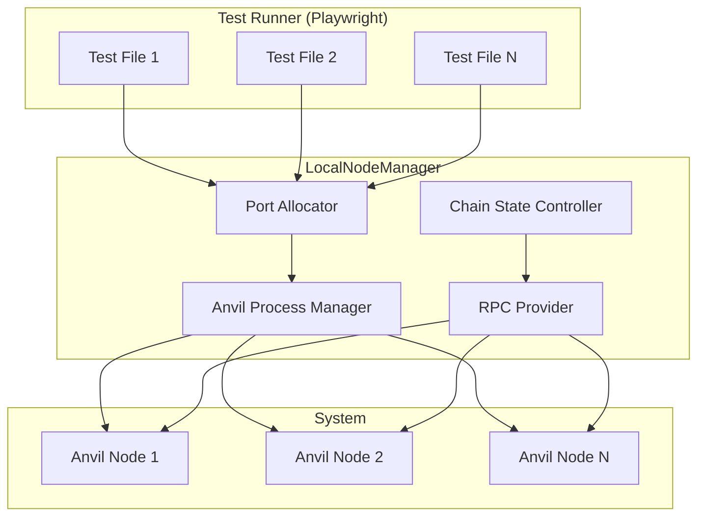
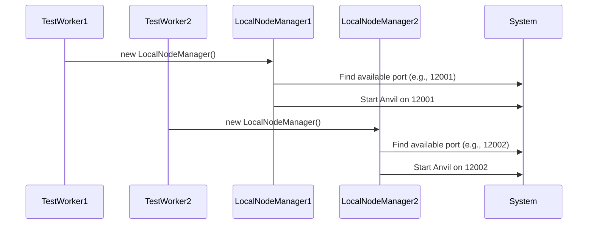

# LocalNodeManager API Documentation

> **Package:** `@coinbase/onchaintestkit`

---

## Overview

The `LocalNodeManager` is a core utility of the [`@coinbase/onchaintestkit`](https://www.npmjs.com/package/@coinbase/onchaintestkit) package, providing robust, programmatic control over local Ethereum (Anvil) nodes for end-to-end blockchain application testing. It is designed for seamless integration with Playwright and supports advanced scenarios such as parallel test execution, dynamic port allocation, chain state manipulation, and account impersonation.

**Why is this important?**  
Testing blockchain applications often requires fine-grained control over the blockchain state, fast resets, and the ability to run multiple isolated nodes in parallel. `LocalNodeManager` abstracts away the complexity of managing Anvil nodes, enabling reliable, reproducible, and scalable test environments for dApps, smart contracts, and wallet integrations.

---

## Architecture



---

## Usage Example

```typescript
import { LocalNodeManager } from '@coinbase/onchaintestkit'

// Create a node manager with automatic port allocation
const node = new LocalNodeManager({
    chainId: baseSepolia.id,
    forkUrl: process.env.E2E_TEST_FORK_URL,
    forkBlockNumber: BigInt(process.env.E2E_TEST_FORK_BLOCK_NUMBER ?? "0"),
    hardfork: "cancun",
})

await node.start()
console.log(`Node running on port ${node.getPort()}`)

// Manipulate chain state
const snapshotId = await node.snapshot()
// ...run tests...
await node.revert(snapshotId)

await node.stop()
```

---

## API Reference

### Class: `LocalNodeManager`

#### Description

Manages the lifecycle and state of a local Anvil Ethereum node for testing. Handles dynamic port allocation, process management, and exposes a rich set of methods for manipulating the blockchain state.

---

### Constructor

| Signature | Description |
|-----------|-------------|
| `new LocalNodeManager(config?: NodeConfig)` | Creates a new instance with the specified configuration. |

#### Parameters

| Name   | Type        | Description |
|--------|-------------|-------------|
| config | `NodeConfig` | Optional. Node configuration options (see [NodeConfig](#type-nodeconfig)). |

---

### Methods

| Method | Description |
|--------|-------------|
| [`start()`](#start) | Starts the Anvil node with the configured options. |
| [`stop()`](#stop) | Stops the running Anvil node and cleans up resources. |
| [`getPort()`](#getport) | Returns the allocated port number for this node instance. |
| [`snapshot()`](#snapshot) | Takes a snapshot of the current chain state. |
| [`revert(snapshotId)`](#revert) | Reverts the chain state to a previous snapshot. |
| [`reset(forkBlock?)`](#reset) | Resets the chain state to initial state or specified fork block. |
| [`mine(blocks?)`](#mine) | Mines a specified number of blocks. |
| [`setAutomine(enabled)`](#setautomine) | Enables or disables automatic block mining. |
| [`setNextBlockTimestamp(timestamp)`](#setnextblocktimestamp) | Sets the timestamp for the next block. |
| [`increaseTime(seconds)`](#increasetime) | Increases chain time by specified seconds. |
| [`setTime(timestamp)`](#settime) | Sets absolute chain time. |
| [`getAccounts()`](#getaccounts) | Gets list of available accounts. |
| [`setBalance(address, balance)`](#setbalance) | Sets balance for specified address. |
| [`setNonce(address, nonce)`](#setnonce) | Sets nonce for specified address. |
| [`setCode(address, code)`](#setcode) | Sets contract code at specified address. |
| [`setStorageAt(address, slot, value)`](#setstorageat) | Sets storage value at specified slot. |
| [`setNextBlockBaseFeePerGas(fee)`](#setnextblockbasefeepergas) | Sets base fee for next block (EIP-1559). |
| [`setMinGasPrice(price)`](#setmingasprice) | Sets minimum gas price. |
| [`setChainId(chainId)`](#setchainid) | Sets chain ID. |
| [`impersonateAccount(address)`](#impersonateaccount) | Enables impersonation of specified account. |
| [`stopImpersonatingAccount(address)`](#stopimpersonatingaccount) | Disables impersonation of specified account. |

---

#### Method Details

##### start

```typescript
async start(): Promise<void>
```
Starts the Anvil node with the configured options. Allocates a port, spawns the process, and waits for readiness.

---

##### stop

```typescript
async stop(): Promise<void>
```
Stops the running Anvil node and cleans up resources.

---

##### getPort

```typescript
getPort(): number | null
```
Returns the allocated port number for this node instance, or `null` if not started.

---

##### snapshot

```typescript
async snapshot(): Promise<string>
```
Takes a snapshot of the current chain state. Returns a snapshot ID for later use with `revert()`.

---

##### revert

```typescript
async revert(snapshotId: string): Promise<void>
```
Reverts the chain state to a previous snapshot.

- `snapshotId`: The ID returned from `snapshot()`.

---

##### reset

```typescript
async reset(forkBlock?: bigint): Promise<void>
```
Resets the chain state to the initial state or a specified fork block.

- `forkBlock`: Optional block number to reset to (when in fork mode).

---

##### mine

```typescript
async mine(blocks = 1): Promise<void>
```
Mines a specified number of blocks (default: 1).

---

##### setAutomine

```typescript
async setAutomine(enabled: boolean): Promise<void>
```
Enables or disables automatic block mining.

---

##### setNextBlockTimestamp

```typescript
async setNextBlockTimestamp(timestamp: number): Promise<void>
```
Sets the timestamp for the next block (Unix seconds).

---

##### increaseTime

```typescript
async increaseTime(seconds: number): Promise<void>
```
Increases chain time by the specified number of seconds.

---

##### setTime

```typescript
async setTime(timestamp: number): Promise<void>
```
Sets absolute chain time (Unix seconds).

---

##### getAccounts

```typescript
async getAccounts(): Promise<string[]>
```
Returns an array of available account addresses.

---

##### setBalance

```typescript
async setBalance(address: string, balance: bigint): Promise<void>
```
Sets the balance for the specified address (in wei).

---

##### setNonce

```typescript
async setNonce(address: string, nonce: number): Promise<void>
```
Sets the nonce for the specified address.

---

##### setCode

```typescript
async setCode(address: string, code: string): Promise<void>
```
Sets the contract code at the specified address.

---

##### setStorageAt

```typescript
async setStorageAt(address: string, slot: string, value: string): Promise<void>
```
Sets the storage value at the specified slot for a contract.

---

##### setNextBlockBaseFeePerGas

```typescript
async setNextBlockBaseFeePerGas(fee: bigint): Promise<void>
```
Sets the base fee for the next block (EIP-1559).

---

##### setMinGasPrice

```typescript
async setMinGasPrice(price: bigint): Promise<void>
```
Sets the minimum gas price.

---

##### setChainId

```typescript
async setChainId(chainId: number): Promise<void>
```
Sets the chain ID.

---

##### impersonateAccount

```typescript
async impersonateAccount(address: string): Promise<void>
```
Enables impersonation of the specified account.

---

##### stopImpersonatingAccount

```typescript
async stopImpersonatingAccount(address: string): Promise<void>
```
Disables impersonation of the specified account.

---

### Properties

| Name | Type | Description |
|------|------|-------------|
| `port` | `number` | The allocated port number, or -1 if not started. |
| `rpcUrl` | `string` | The RPC URL for the running node (e.g., `http://localhost:12345`). |

---

### Type: `NodeConfig`

Configuration options for `LocalNodeManager`.

| Property | Type | Description |
|----------|------|-------------|
| `port` | `number` | Port number for RPC server (optional). |
| `portRange` | `[number, number]` | Port range for automatic port selection (optional). |
| `chainId` | `number` | Chain ID for the network (default: 84532). |
| `mnemonic` | `string` | Mnemonic for the network (optional). |
| `forkUrl` | `string` | URL to fork from (e.g., mainnet) (optional). |
| `forkBlockNumber` | `bigint` | Block number to fork from (optional). |
| `forkRetryInterval` | `number` | Retry interval for fork requests (optional). |
| `defaultBalance` | `bigint` | Default balance for test accounts (optional). |
| `totalAccounts` | `number` | Number of test accounts to generate (optional). |
| `blockTime` | `number` | Time between blocks (0 for instant, default: 0). |
| `blockGasLimit` | `bigint` | Gas limit per block (optional). |
| `noMining` | `boolean` | Disable automatic mining (optional). |
| `hardfork` | `"london" \| "berlin" \| "cancun"` | Specific hardfork to use (optional). |

---

## Parallel Test Execution

`LocalNodeManager` is designed for parallel test execution. It dynamically allocates ports for each node instance, ensuring no conflicts even across multiple processes.



---

## Advanced: RPC Port Interception

When your dApp or test expects the RPC endpoint at `http://localhost:8545`, but your node is running on a dynamic port, use the provided utility to intercept and rewrite requests:

```typescript
import { setupRpcPortInterceptor } from '@coinbase/onchaintestkit'
import { Page } from '@playwright/test'

await setupRpcPortInterceptor(page, node.getPort())
```

This ensures all requests to `http://localhost:8545` are transparently redirected to the correct port.

---

## NodeFixturesBuilder

For Playwright integration, use `NodeFixturesBuilder` to automatically manage node lifecycle in your test fixtures:

```typescript
import { NodeFixturesBuilder } from '@coinbase/onchaintestkit'

const nodeFixtures = new NodeFixturesBuilder({
  chainId: 84532,
  mnemonic: process.env.E2E_TEST_SEED_PHRASE,
}).build()

export const test = nodeFixtures
```

---

## Variables

| Variable | Type | Description |
|----------|------|-------------|
| `DEFAULT_PORT_RANGE` | `[number, number]` | Default port range for dynamic allocation (`[10000, 20000]`). |
| `MAX_PORT_ALLOCATION_RETRIES` | `number` | Maximum retries for port allocation (`5`). |
| `process` | `ChildProcess \| null` | Reference to the running Anvil process. |
| `provider` | `ethers.providers.JsonRpcProvider \| null` | JSON-RPC provider for interacting with the node. |
| `config` | `NodeConfig` | Configuration for the node. |
| `allocatedPort` | `number \| null` | The port allocated for this node instance. |

---

## Events

| Event | Description |
|-------|-------------|
| `process.on("error", handler)` | Emitted if the Anvil process encounters an error. |
| `process.on("exit", handler)` | Emitted when the Anvil process exits. |
| `process.stdout.on("data", handler)` | Emitted when Anvil outputs to stdout (used for readiness detection). |
| `process.stderr.on("data", handler)` | Emitted when Anvil outputs to stderr (for debugging). |

---

## Example: Parallel Playwright Test

```typescript
import { test as base } from '@playwright/test'
import { NodeFixturesBuilder } from '@coinbase/onchaintestkit'

const nodeFixtures = new NodeFixturesBuilder({
  chainId: 84532,
  mnemonic: process.env.E2E_TEST_SEED_PHRASE,
}).build()

const test = nodeFixtures

test('runs with isolated node', async ({ node }) => {
  await node.mine(5)
  const accounts = await node.getAccounts()
  // ...test logic...
})
```

---

## Best Practices

- Always call `await node.stop()` after your test to free resources.
- Use `test.afterEach()` or fixture scopes to ensure cleanup.
- Use snapshots and reverts for fast, deterministic test state.
- Use a wide port range for parallel test reliability.
- Use `setupRpcPortInterceptor` for seamless dApp RPC integration.

---

## See Also

- [@coinbase/onchaintestkit on npm](https://www.npmjs.com/package/@coinbase/onchaintestkit)
- [Playwright documentation](https://playwright.dev/)
- [Anvil documentation](https://book.getfoundry.sh/anvil/)

---

**© Coinbase, Inc.**