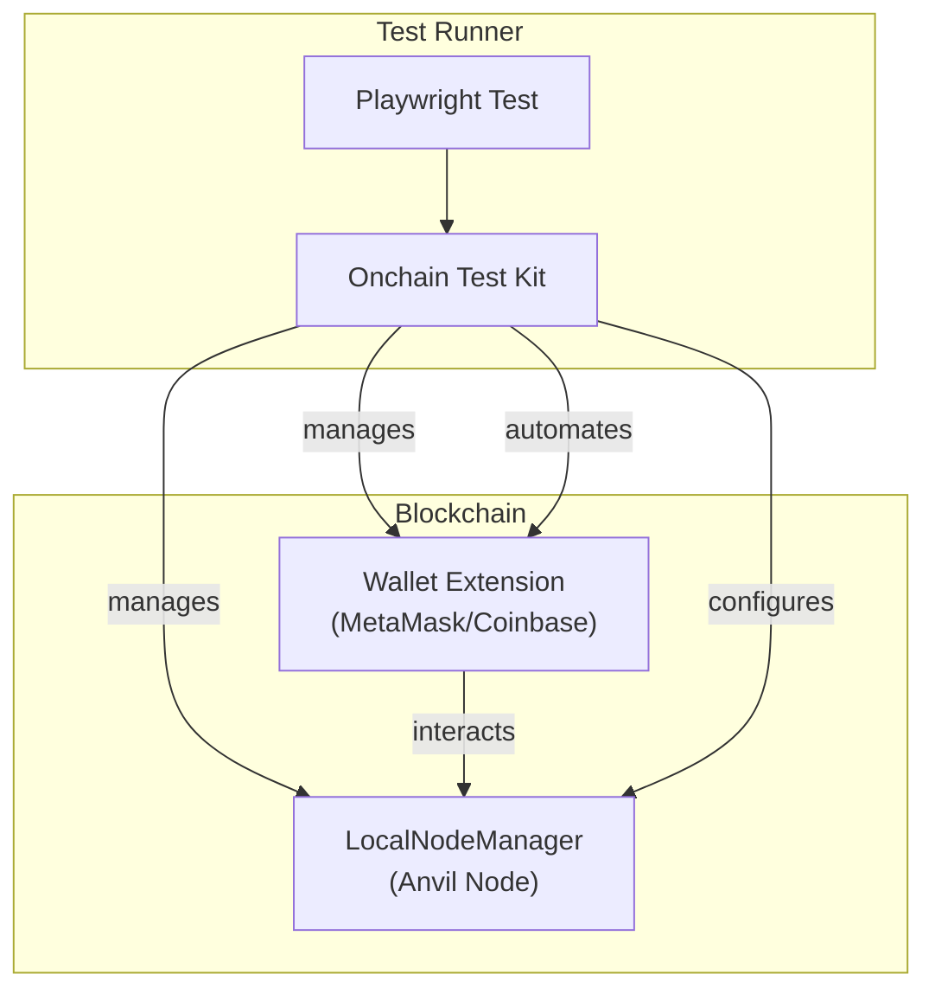
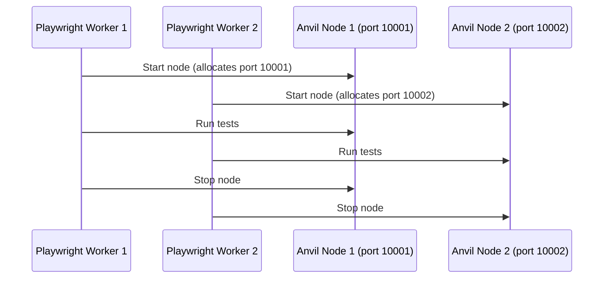

# @coinbase/onchaintestkit

End-to-end testing toolkit for blockchain applications, powered by Playwright.

---

## Overview

`@coinbase/onchaintestkit` is a comprehensive, type-safe framework for end-to-end testing of blockchain applications. It provides seamless integration with Playwright, enabling robust automation of browser-based wallet interactions, local blockchain node management, and common blockchain testing scenarios. The toolkit supports multiple wallets (MetaMask, Coinbase Wallet), dynamic network configuration, and parallel test execution with isolated local nodes.

### Why is it Important?

Modern blockchain applications require rigorous testing of wallet interactions, transaction flows, and network behavior. Manual testing is error-prone and slow, especially when dealing with complex wallet UIs and multiple networks. `@coinbase/onchaintestkit` automates these processes, ensuring reliability, reproducibility, and scalability for your dApp's test suite.

---

## Architecture



---

## Key Features

- **Playwright Integration**: Automate browser-based wallet and dApp interactions.
- **Wallet Support**: MetaMask and Coinbase Wallet, with extensible architecture.
- **Action Handling**: Automate connect, transaction, signature, approval, and network switching flows.
- **Network Management**: Use local Anvil nodes or remote RPC endpoints, with dynamic port allocation for parallelism.
- **Type Safety**: Full TypeScript support for all configuration and test APIs.
- **Fluent Configuration**: Builder pattern for wallet and node setup.
- **Parallel Testing**: Reliable cross-process port allocation for running multiple nodes in parallel.

---

## Getting Started

### Example: Basic Wallet Test

```typescript
import { configure, createOnchainTest, BaseActionType } from '@coinbase/onchaintestkit';

const test = createOnchainTest(
  configure()
    .withLocalNode({ chainId: 1337 })
    .withMetaMask()
    .withNetwork({
      name: 'Base Sepolia',
      rpcUrl: 'http://localhost:8545',
      chainId: 84532,
      symbol: 'ETH',
    })
    .withSeedPhrase({
      seedPhrase: process.env.E2E_TEST_SEED_PHRASE!,
      password: 'PASSWORD',
    })
    .build()
);

test('connect wallet and swap', async ({ page, metamask }) => {
  await page.getByTestId('ockConnectButton').click();
  await metamask.handleAction(BaseActionType.CONNECT_TO_DAPP);
  // ... further dApp and wallet interactions
});
```

---

## Configuration Builder

The toolkit uses a fluent builder pattern for configuration, supporting both MetaMask and Coinbase Wallet.

### Example: Full Configuration

```typescript
import { configure } from '@coinbase/onchaintestkit';

const config = configure()
  .withLocalNode({ chainId: 1337 })
  .withMetaMask()
  .withNetwork({
    name: 'Base Sepolia',
    rpcUrl: 'http://localhost:8545',
    chainId: 84532,
    symbol: 'ETH',
  })
  .withSeedPhrase({
    seedPhrase: 'your seed phrase',
    password: 'your password',
  })
  .withCustomSetup(async (wallet) => {
    await wallet.importToken('0x...');
  })
  .build();
```

### Configuration Builder API

| Method                | Description                                                                                   |
|-----------------------|----------------------------------------------------------------------------------------------|
| `withMetaMask()`      | Initialize MetaMask wallet configuration.                                                    |
| `withCoinbase()`      | Initialize Coinbase Wallet configuration.                                                    |
| `withSeedPhrase()`    | Set wallet seed phrase and optional password.                                                |
| `withNetwork()`       | Configure network (name, rpcUrl, chainId, symbol).                                           |
| `withLocalNode()`     | Configure local Anvil node (chainId, mnemonic, port range, etc.).                            |
| `withCustomSetup()`   | Add custom async setup steps for the wallet (e.g., import tokens, set up contracts, etc.).   |
| `build()`             | Finalize and return the configuration object.                                                |

---

## Wallet Actions

### Base Actions

```typescript
enum BaseActionType {
  CONNECT_TO_DAPP = 'CONNECT_TO_DAPP',
  HANDLE_TRANSACTION = 'HANDLE_TRANSACTION',
  HANDLE_SIGNATURE = 'HANDLE_SIGNATURE',
  CHANGE_SPENDING_CAP = 'CHANGE_SPENDING_CAP',
  SWITCH_NETWORK = 'SWITCH_NETWORK',
  IMPORT_WALLET_FROM_SEED = 'IMPORT_WALLET_FROM_SEED',
}
```

### Notification Types

```typescript
enum NotificationPageType {
  Transaction = 'Transaction',
  SpendingCap = 'SpendingCap',
  Signature = 'Signature',
}
```

### Approval Types

```typescript
enum ActionApprovalType {
  APPROVE = 'APPROVE',
  REJECT = 'REJECT',
}
```

---

## LocalNodeManager

The `LocalNodeManager` class manages local Anvil Ethereum nodes for isolated, reproducible blockchain state during tests.

### Features

- **Lifecycle**: Start/stop nodes, get allocated port.
- **State**: Create/revert snapshots, reset chain.
- **Time**: Time travel, mine blocks.
- **Accounts**: Set balances, impersonate accounts.
- **Network**: Set gas price, chain ID.
- **Parallelism**: Dynamic port allocation for parallel test workers.

### Example: Parallel Node Management

```typescript
import { LocalNodeManager } from '@coinbase/onchaintestkit';

const nodeManager = new LocalNodeManager({
  chainId: 84532,
  mnemonic: process.env.E2E_TEST_SEED_PHRASE,
  // Optional: portRange: [10000, 20000]
});

await nodeManager.start();
const port = nodeManager.getPort();
console.log(`Node running on port ${port}`);
// ... run tests ...
await nodeManager.stop();
```

#### Parallel Test Execution



---

## API Reference

### Functions

| Function                       | Description                                                                                           |
|--------------------------------|-------------------------------------------------------------------------------------------------------|
| `configure()`                  | Creates a new configuration builder instance.                                                         |
| `createOnchainTest(options)`   | Creates a Playwright test instance with wallet and node fixtures based on the provided configuration.  |
| `setupMetaMask()`              | Utility to prepare MetaMask extension for testing.                                                    |
| `setupRpcPortInterceptor()`    | Intercepts RPC requests to redirect to the correct local node port.                                   |

### Classes

#### ConfigBuilder

| Method                 | Description                                                                                   |
|------------------------|----------------------------------------------------------------------------------------------|
| `withMetaMask()`       | Initialize MetaMask wallet configuration.                                                    |
| `withCoinbase()`       | Initialize Coinbase Wallet configuration.                                                    |
| `withSeedPhrase()`     | Set wallet seed phrase and optional password.                                                |
| `withNetwork()`        | Configure network (name, rpcUrl, chainId, symbol).                                           |
| `withLocalNode()`      | Configure local Anvil node (chainId, mnemonic, port range, etc.).                            |
| `withCustomSetup()`    | Add custom async setup steps for the wallet.                                                 |
| `build()`              | Finalize and return the configuration object.                                                |

#### LocalNodeManager

| Method           | Description                                       |
|------------------|--------------------------------------------------|
| `start()`        | Starts the local Anvil node.                      |
| `stop()`         | Stops the node and releases resources.            |
| `getPort()`      | Returns the allocated port for the node.          |
| `snapshot()`     | Creates a blockchain state snapshot.              |
| `revert()`       | Reverts to a previously created snapshot.         |
| `setBalance()`   | Sets the balance of an account.                   |
| `impersonate()`  | Impersonates an account for testing.              |

---

### Variables

| Variable             | Description                                                         |
|----------------------|---------------------------------------------------------------------|
| `CACHE_DIR_NAME`     | Directory name for caching test artifacts.                          |
| `fixtureBuilderMap`  | Map of wallet names to their fixture builder functions.             |

---

### Events

- **Wallet Action Events**: Triggered when wallet actions are performed (e.g., connect, sign, approve).
- **Node Lifecycle Events**: Start/stop events for local nodes.
- **Network Interception Events**: When RPC requests are redirected to the correct node port.

---

## Example: MetaMask Wallet Test

```typescript
import { configure, createOnchainTest, BaseActionType } from '@coinbase/onchaintestkit';

const test = createOnchainTest(
  configure()
    .withLocalNode({ chainId: 1337 })
    .withMetaMask()
    .withNetwork({
      name: 'Base Sepolia',
      rpcUrl: 'http://localhost:8545',
      chainId: 84532,
      symbol: 'ETH',
    })
    .withSeedPhrase({
      seedPhrase: process.env.E2E_TEST_SEED_PHRASE!,
      password: 'PASSWORD',
    })
    .build()
);

test('connect wallet and swap', async ({ page, metamask }) => {
  await page.getByTestId('ockConnectButton').click();
  await metamask.handleAction(BaseActionType.CONNECT_TO_DAPP);
  // ... further dApp and wallet interactions
});
```

---

## Example: Coinbase Wallet Test

```typescript
import { configure, createOnchainTest, BaseActionType } from '@coinbase/onchaintestkit';

const test = createOnchainTest(
  configure()
    .withLocalNode({ chainId: 1337 })
    .withCoinbase()
    .withNetwork({
      name: 'Base Sepolia',
      rpcUrl: 'http://localhost:8545',
      chainId: 84532,
      symbol: 'ETH',
    })
    .withSeedPhrase({
      seedPhrase: process.env.E2E_TEST_SEED_PHRASE!,
      password: 'PASSWORD',
    })
    .build()
);

test('connect coinbase wallet', async ({ page, coinbase }) => {
  await page.getByTestId('ockConnectButton').click();
  await coinbase.handleAction(BaseActionType.CONNECT_TO_DAPP);
  // ... further dApp and wallet interactions
});
```

---

## Example: Custom Wallet Setup

```typescript
import { configure, createOnchainTest } from '@coinbase/onchaintestkit';

const test = createOnchainTest(
  configure()
    .withMetaMask()
    .withSeedPhrase({
      seedPhrase: process.env.E2E_TEST_SEED_PHRASE!,
      password: 'PASSWORD',
    })
    .withCustomSetup(async (wallet) => {
      await wallet.importToken('0x...');
    })
    .build()
);

test('custom setup', async ({ metamask }) => {
  // Custom setup steps have already run
});
```

---

## Types

### WalletFixtureOptions

```typescript
type WalletFixtureOptions = {
  wallets: {
    metamask?: MetaMaskConfig;
    coinbase?: CoinbaseConfig;
  };
  nodeConfig?: NodeConfig;
};
```

### OnchainFixtures

```typescript
type OnchainFixtures = {
  metamask?: MetaMask;
  coinbase?: CoinbaseWallet;
  node?: LocalNodeManager;
  smartContractManager?: SmartContractManager;
};
```

---

## Best Practices

- Always call `nodeManager.stop()` after tests to release resources.
- Use `test.afterEach()` to ensure cleanup even on failure.
- Use environment variables for sensitive data (e.g., seed phrases).
- Use snapshots for efficient state resets between test steps.
- Keep port ranges large enough for your parallel worker count.

---

## Summary

`@coinbase/onchaintestkit` provides a robust, extensible, and type-safe foundation for end-to-end blockchain application testing. By automating wallet and node management, it enables reliable, scalable, and maintainable test suites for modern dApps.

---