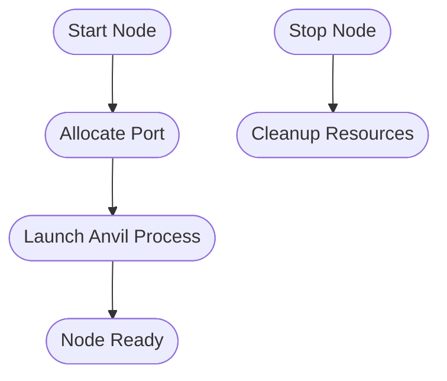
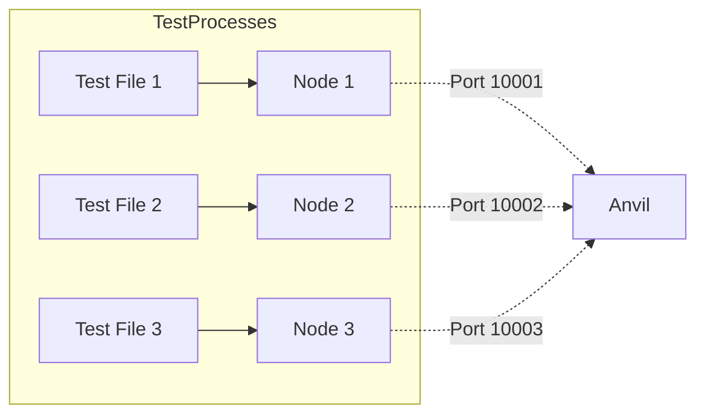

# Onchain Test Kit

**@coinbase/onchaintestkit** is an end-to-end testing toolkit for blockchain applications, built on top of Playwright. It provides a robust, type-safe, and extensible framework for automating wallet interactions, managing local blockchain nodes, and orchestrating complex blockchain testing scenarios.

---

## Overview

**Onchain Test Kit** is designed to streamline the process of writing, running, and maintaining reliable E2E tests for decentralized applications (dApps). It abstracts away the complexity of browser automation, wallet management, and local node orchestration, enabling developers to focus on business logic and user flows.

**Key Capabilities:**

- **Wallet Automation:** Seamlessly interact with MetaMask and Coinbase Wallet in browser-based tests.
- **Network Management:** Easily configure and switch between test networks using [viem](https://viem.sh/) chains.
- **Local Node Orchestration:** Spin up, snapshot, and manage local Ethereum nodes (Anvil) for deterministic testing.
- **Parallelization:** Supports parallel test execution with automatic port allocation for multiple local nodes.
- **Type Safety:** Built with TypeScript for robust, maintainable test code.

---

## Why Onchain Test Kit?

Testing blockchain applications is uniquely challenging due to:

- The need for deterministic blockchain state.
- Complex wallet interactions (signatures, approvals, network switching).
- Parallel test execution without port or state conflicts.
- Automation of browser extensions (wallets) in headless environments.

**@coinbase/onchaintestkit** solves these challenges by providing a unified, extensible toolkit that integrates tightly with Playwright and modern blockchain tooling.

---

## Utility Functions

This section documents the utility functions provided by the toolkit, which are essential for managing temporary directories, browser extensions, Playwright fixtures, and filesystem cleanup.

---

### API Reference

| Function              | Description                                                                                 |
|-----------------------|---------------------------------------------------------------------------------------------|
| `createTempDir`       | Creates a unique temporary directory with a given prefix.                                   |
| `getExtensionId`      | Discovers and retrieves the unique identifier for a browser extension in Playwright context.|
| `mergeFixtures`       | Merges custom Playwright fixtures with the base test type.                                  |
| `removeTempDir`       | Removes a temporary directory, logging a warning if cleanup fails.                          |

---

### Function Details

#### `createTempDir(prefix: string): Promise<string>`

Creates a unique temporary directory in the system's temp folder.

**Parameters:**

| Name   | Type   | Description                 |
|--------|--------|----------------------------|
| prefix | string | Prefix for the temp folder. |

**Returns:**  
`Promise<string>` – The path to the created temporary directory.

**Example:**

```typescript
import { createTempDir } from '@coinbase/onchaintestkit';

const tempDir = await createTempDir('mytest-');
console.log(tempDir); // e.g., /tmp/mytest-abc123
```

---

#### `getExtensionId(context: BrowserContext, extensionName: string): Promise<string>`

Discovers and retrieves the unique identifier for a browser extension in a Playwright browser context.

**Parameters:**

| Name          | Type            | Description                                  |
|---------------|-----------------|----------------------------------------------|
| context       | BrowserContext  | Playwright browser context.                  |
| extensionName | string          | Name of the extension to search for.         |

**Returns:**  
`Promise<string>` – The extension's unique identifier.

**Example:**

```typescript
import { getExtensionId } from '@coinbase/onchaintestkit';
import { chromium } from '@playwright/test';

const context = await chromium.launchPersistentContext('', { headless: false });
const metamaskId = await getExtensionId(context, 'MetaMask');
console.log(metamaskId); // e.g., 'nkbihfbeogaeaoehlefnkodbefgpgknn'
```

---

#### `mergeFixtures<CustomFixtures>(customFixtures: TestType<CustomFixtures, object>): TestType<CustomFixtures, object>`

Merges custom Playwright fixtures with the base test type, allowing you to extend the test environment with additional fixtures.

**Parameters:**

| Name           | Type                                 | Description                 |
|----------------|--------------------------------------|-----------------------------|
| customFixtures | TestType<CustomFixtures, object>     | Custom fixtures to merge.   |

**Returns:**  
`TestType<CustomFixtures, object>` – The merged test type.

**Example:**

```typescript
import { mergeFixtures } from '@coinbase/onchaintestkit';
import { test as base } from '@playwright/test';

const test = mergeFixtures(base.extend({
  myFixture: async ({}, use) => {
    await use('value');
  },
}));

test('uses custom fixture', async ({ myFixture }) => {
  expect(myFixture).toBe('value');
});
```

---

#### `removeTempDir(dirPath: string): Promise<Error | null>`

Removes a temporary directory and logs a warning if cleanup fails.

**Parameters:**

| Name    | Type   | Description                    |
|---------|--------|--------------------------------|
| dirPath | string | Path to the directory to remove.|

**Returns:**  
`Promise<Error | null>` – Returns `null` if successful, or the error if cleanup failed.

**Example:**

```typescript
import { removeTempDir } from '@coinbase/onchaintestkit';

const error = await removeTempDir('/tmp/mytest-abc123');
if (error) {
  console.warn('Cleanup failed:', error);
}
```

---

## LocalNodeManager

The `LocalNodeManager` class provides a comprehensive interface for managing local Anvil Ethereum nodes during testing. It is essential for deterministic, parallelizable blockchain testing.

### Features

- **Node Lifecycle:** Start and stop Anvil nodes programmatically.
- **State Management:** Create and revert snapshots, reset chain state.
- **Time Control:** Advance time, mine blocks.
- **Account Management:** Set balances, impersonate accounts.
- **Network Configuration:** Set gas price, chain ID.
- **Parallelization:** Automatic, cross-process port allocation for parallel test runs.

---

### Mermaid Diagram: Node Lifecycle



---

### Example Usage

```typescript
import { LocalNodeManager } from '@coinbase/onchaintestkit';

const nodeManager = new LocalNodeManager({
  chainId: 84532,
  mnemonic: process.env.E2E_TEST_SEED_PHRASE,
  // Optional: portRange: [10000, 20000]
});

await nodeManager.start();
const port = nodeManager.getPort();
console.log(`Node running on port ${port}`);

// ...run tests...

await nodeManager.stop();
```

---

### API Table

| Method         | Description                                                                                 |
|----------------|---------------------------------------------------------------------------------------------|
| `start()`      | Starts the Anvil node, automatically allocating an available port.                          |
| `stop()`       | Stops the Anvil node and cleans up resources.                                               |
| `getPort()`    | Returns the port the node is running on.                                                    |
| `snapshot()`   | Creates a blockchain state snapshot.                                                        |
| `revert()`     | Reverts to the last snapshot.                                                               |
| `setBalance()` | Sets the balance of an account.                                                             |
| `impersonateAccount()` | Starts impersonating an account.                                                    |
| `setGasPrice()`| Sets the gas price for the node.                                                            |
| ...            | ...and more (see full class documentation).                                                 |

---

### Parallel Test Execution

**@coinbase/onchaintestkit** enables parallel Playwright test execution by ensuring each test process gets a unique Anvil node and port.

#### Mermaid Diagram: Parallel Node Allocation



---

### Best Practices

- Always call `stop()` on your `LocalNodeManager` to free resources.
- Use `test.afterEach()` to ensure cleanup even on test failure.
- Use snapshots for efficient state resets between test steps.
- Configure a sufficiently large port range for your expected parallelism.

---

## Example: Full E2E Test with Wallet and Node

```typescript
import { createOnchainTest, LocalNodeManager } from '@coinbase/onchaintestkit';
import { configure } from '@coinbase/onchaintestkit';
import { baseSepolia } from 'viem/chains';

const nodeManager = new LocalNodeManager({
  chainId: baseSepolia.id,
  mnemonic: process.env.E2E_TEST_SEED_PHRASE,
});
await nodeManager.start();

const walletConfig = configure()
  .withMetaMask()
  .withSeedPhrase({
    seedPhrase: process.env.E2E_TEST_SEED_PHRASE ?? '',
    password: 'PASSWORD',
  })
  .withNetwork({
    name: baseSepolia.name,
    rpcUrl: `http://localhost:${nodeManager.getPort()}`,
    chainId: baseSepolia.id,
    symbol: baseSepolia.nativeCurrency.symbol,
  })
  .build();

const test = createOnchainTest(walletConfig);

test('connect wallet and swap', async ({ page, metamask }) => {
  // ...test logic as shown in the overview...
});

await nodeManager.stop();
```

---

## Variables

| Variable              | Description                                               |
|-----------------------|-----------------------------------------------------------|
| `DEFAULT_PASSWORD`    | Default password for wallet seed phrase import.           |
| `DEFAULT_SEED_PHRASE` | Seed phrase for test wallet, typically from env variable. |
| `metamaskWalletConfig`| Example wallet configuration using MetaMask.              |

---

## Events

This toolkit is primarily function- and class-based; it does not expose custom event emitters. All asynchronous actions (such as node start/stop, wallet actions) return Promises and should be awaited.

---

## Summary

**@coinbase/onchaintestkit** is an essential toolkit for robust, parallelizable, and deterministic E2E testing of blockchain applications. By abstracting away the complexity of wallet automation, local node management, and Playwright integration, it empowers teams to deliver high-quality dApps with confidence.

For more advanced usage, see the full API documentation and explore the example test suites included in the repository.

---