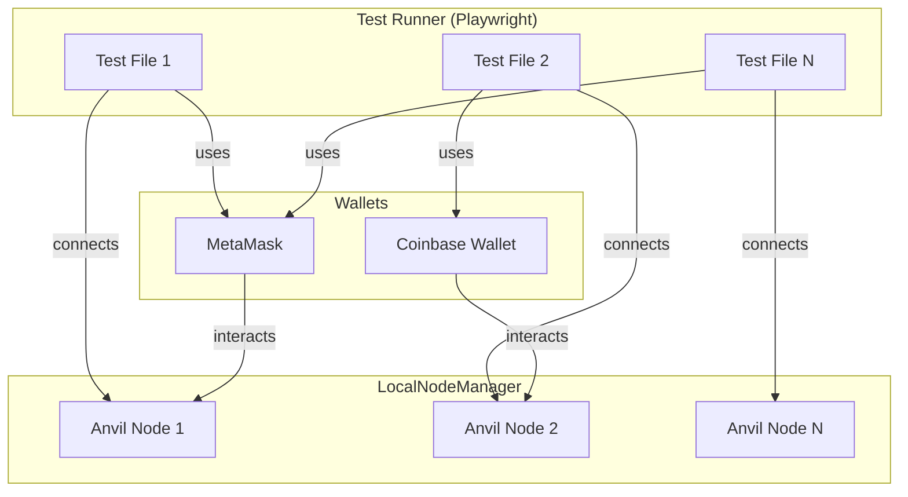
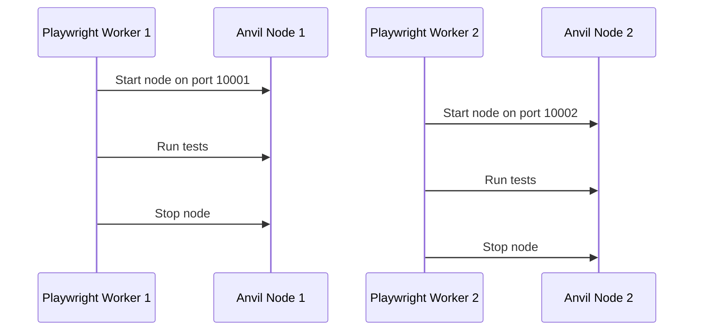

## Overview

**@coinbase/onchaintestkit** is a comprehensive end-to-end testing framework designed for blockchain applications. It provides robust, type-safe abstractions for automating wallet interactions, network management, and common blockchain testing scenarios. Built on top of [Playwright](https://playwright.dev/), it enables developers to write reliable, maintainable, and parallelizable tests for dApps that interact with wallets like MetaMask and Coinbase Wallet.

### Why is it important?

- **Automates Real User Flows:** Simulates real-world wallet interactions, including onboarding, network switching, transaction approvals, and more.
- **Parallel Test Execution:** Supports parallel test runs with isolated local blockchain nodes, ensuring fast and reliable CI/CD pipelines.
- **Type Safety and Extensibility:** Written in TypeScript with extensible APIs for custom wallet actions and network configurations.
- **Production-Grade Reliability:** Handles edge cases like notification popups, passkey authentication, and extension state management.

---

## Architecture



---

## Core Concepts

### 1. Wallet Abstraction

- **MetaMask** and **Coinbase Wallet** are modeled as programmable objects.
- Actions like importing wallets, switching networks, and handling notifications are exposed as high-level methods.

### 2. Local Node Management

- Each test can spin up its own local Ethereum node (Anvil) with automatic port allocation.
- Supports chain state manipulation (snapshots, reverts), time travel, and account impersonation.

### 3. Parallelization

- Designed for parallel Playwright test execution.
- Each worker gets a unique node and wallet context, avoiding cross-test interference.

---

## Quick Start

### 1. Install

```bash
npm install --save-dev @playwright/test @coinbase/onchaintestkit
```

### 2. Configure Environment

```env
E2E_TEST_SEED_PHRASE="your test wallet seed phrase"
```

### 3. Create Wallet Configuration

```typescript
import { configure } from '@coinbase/onchaintestkit';
import { baseSepolia } from 'viem/chains';

export const metamaskWalletConfig = configure()
  .withMetaMask()
  .withSeedPhrase({
    seedPhrase: process.env.E2E_TEST_SEED_PHRASE ?? '',
    password: 'PASSWORD',
  })
  .withNetwork({
    name: baseSepolia.name,
    rpcUrl: baseSepolia.rpcUrls.default.http[0],
    chainId: baseSepolia.id,
    symbol: baseSepolia.nativeCurrency.symbol,
  })
  .build();
```

### 4. Write a Test

```typescript
import { metamaskWalletConfig } from './walletConfig/metamaskWalletConfig';
import { createOnchainTest } from '@coinbase/onchaintestkit';

const test = createOnchainTest(metamaskWalletConfig);
const { expect } = test;

test('connect wallet and swap', async ({ page, metamask }) => {
  if (!metamask) throw new Error('MetaMask fixture is required');

  await page.getByTestId('ockConnectButton').click();
  await page.getByTestId('ockModalOverlay').first().getByRole('button', { name: 'MetaMask' }).click();
  await metamask.handleAction('CONNECT_TO_DAPP');
  await page.getByTestId('tos-accept-button').click();

  await page.locator('input[placeholder="0.0"]').first().fill('0.0001');
  await page.getByRole('button', { name: 'Swap' }).click();
  await page.getByRole('button', { name: 'Confirm' }).click();

  let notificationType = await metamask.identifyNotificationType();

  if (notificationType === 'SpendingCap') {
    await metamask.handleAction('CHANGE_SPENDING_CAP', { approvalType: 'APPROVE' });
  }

  notificationType = await metamask.identifyNotificationType();

  if (notificationType === 'SpendingCap') {
    await metamask.handleAction('HANDLE_SIGNATURE', { approvalType: 'APPROVE' });
  }

  notificationType = await metamask.identifyNotificationType();

  if (notificationType === 'Transaction') {
    await metamask.handleAction('HANDLE_TRANSACTION', { approvalType: 'APPROVE' });
  }

  await expect(page.getByRole('link', { name: 'View on Explorer' })).toBeVisible();
});
```

---

## Configuration Builder

The toolkit uses a fluent builder pattern to configure wallets and networks:

```typescript
const config = configure()
  .withMetaMask()
  .withSeedPhrase({
    seedPhrase: 'your seed phrase',
    password: 'your password',
  })
  .withNetwork({
    name: 'Network Name',
    rpcUrl: 'RPC URL',
    chainId: 1,
    symbol: 'ETH',
  })
  .build();
```

#### Builder Methods

| Method                | Description                                 |
|-----------------------|---------------------------------------------|
| `withMetaMask()`      | Use MetaMask wallet                        |
| `withCoinbase()`      | Use Coinbase Wallet                        |
| `withSeedPhrase()`    | Set wallet seed phrase and password        |
| `withNetwork()`       | Set network parameters                     |
| `withCustomSetup()`   | Add custom wallet setup logic              |

---

## Common Wallet Actions

### Base Actions (Supported by Both Wallets)

```typescript
enum BaseActionType {
  IMPORT_WALLET_FROM_SEED = "importWalletFromSeed",
  IMPORT_WALLET_FROM_PRIVATE_KEY = "importWalletFromPrivateKey",
  SWITCH_NETWORK = "switchNetwork",
  CONNECT_TO_DAPP = "connectToDapp",
  HANDLE_TRANSACTION = "handleTransaction",
  HANDLE_SIGNATURE = "handleSignature",
  CHANGE_SPENDING_CAP = "changeSpendingCap",
  REMOVE_SPENDING_CAP = "removeSpendingCap",
}
```

### Notification Types

```typescript
enum NotificationPageType {
  SpendingCap = "spending-cap",
  Signature = "signature",
  Transaction = "transaction",
  RemoveSpendCap = "remove-spend-cap",
}
```

### Approval Types

```typescript
enum ActionApprovalType {
  APPROVE = "approve",
  REJECT = "reject",
}
```

---

## MetaMask-Specific Features

### MetaMask-Specific Actions

```typescript
enum MetaMaskSpecificActionType {
  LOCK = "lock",                           // Lock the wallet (not yet implemented)
  UNLOCK = "unlock",                       // Unlock the wallet (not yet implemented)
  ADD_TOKEN = "addToken",                  // Add a custom token
  ADD_ACCOUNT = "addAccount",              // Create a new account
  RENAME_ACCOUNT = "renameAccount",        // Rename an account (not yet implemented)
  REMOVE_ACCOUNT = "removeAccount",        // Remove an account
  SWITCH_ACCOUNT = "switchAccount",        // Switch between accounts
  ADD_NETWORK = "addNetwork",              // Add a custom network
  APPROVE_ADD_NETWORK = "approveAddNetwork", // Approve network addition request
}
```

### MetaMask Example: Advanced Account Management

```typescript
import { configure, createOnchainTest, MetaMaskSpecificActionType } from '@coinbase/onchaintestkit';

const config = configure()
  .withMetaMask()
  .withSeedPhrase({ seedPhrase: 'test test ...', password: 'testpass' })
  .build();

const test = createOnchainTest(config);

test('MetaMask account management', async ({ page, metamask }) => {
  // Add a new account
  await metamask.handleAction(MetaMaskSpecificActionType.ADD_ACCOUNT, {
    accountName: 'Trading Account',
  });

  // Switch between accounts
  await metamask.handleAction(MetaMaskSpecificActionType.SWITCH_ACCOUNT, {
    accountName: 'Trading Account',
  });

  // Add a custom network
  await metamask.handleAction(MetaMaskSpecificActionType.ADD_NETWORK, {
    network: {
      name: 'Custom Network',
      rpcUrl: 'https://rpc.custom.network',
      chainId: 12345,
      symbol: 'CUSTOM',
    },
  });

  // Handle network addition approval popup
  await metamask.handleAction(MetaMaskSpecificActionType.APPROVE_ADD_NETWORK, {
    approvalType: 'APPROVE',
  });
});
```

### MetaMask Network Switching

```typescript
test('MetaMask network switching', async ({ page, metamask }) => {
  // Switch to a specific network
  await metamask.handleAction('SWITCH_NETWORK', {
    networkName: 'Base Sepolia',
    isTestnet: true,
  });
});
```

---

## Coinbase Wallet-Specific Features

### Coinbase Wallet-Specific Actions

```typescript
enum CoinbaseSpecificActionType {
  LOCK = "lock",                           // Lock the wallet
  UNLOCK = "unlock",                       // Unlock the wallet
  ADD_TOKEN = "addToken",                  // Add a custom token
  ADD_ACCOUNT = "addAccount",              // Create a new account
  SWITCH_ACCOUNT = "switchAccount",        // Switch between accounts
  ADD_NETWORK = "addNetwork",              // Add a custom network
  SEND_TOKENS = "sendTokens",              // Send tokens (not yet implemented)
  HANDLE_PASSKEY_POPUP = "handlePasskeyPopup", // Handle WebAuthn/Passkey authentication
}
```

### Passkey/WebAuthn Support

Coinbase Wallet supports passkey authentication for enhanced security. The toolkit provides automatic handling of WebAuthn prompts:

```typescript
interface PasskeyConfig {
  name: string;        // Display name for the passkey
  rpId: string;        // Relying Party ID (domain)
  rpName: string;      // Relying Party Name
  userId: string;      // User identifier
  isUserVerified?: boolean; // Whether user verification is required
}
```

### Coinbase Wallet Example: Passkey Authentication

```typescript
import { configure, createOnchainTest, CoinbaseSpecificActionType } from '@coinbase/onchaintestkit';

const config = configure()
  .withCoinbase()
  .withSeedPhrase({ seedPhrase: 'test test ...', password: 'testpass' })
  .build();

const test = createOnchainTest(config);

test('Coinbase Wallet with passkey', async ({ page, coinbase }) => {
  // Handle passkey registration
  const [popup] = await Promise.all([
    page.context().waitForEvent('page'),
    page.getByTestId('register-passkey').click(),
  ]);

  await coinbase.handleAction(CoinbaseSpecificActionType.HANDLE_PASSKEY_POPUP, {
    mainPage: page,
    popup: popup,
    passkeyAction: 'register',
    passkeyConfig: {
      name: 'Test Passkey',
      rpId: 'localhost',
      rpName: 'My dApp',
      userId: 'user123',
      isUserVerified: true,
    },
  });

  // Later, handle passkey approval for transactions
  const [txPopup] = await Promise.all([
    page.context().waitForEvent('page'),
    page.getByRole('button', { name: 'Send Transaction' }).click(),
  ]);

  await coinbase.handleAction(CoinbaseSpecificActionType.HANDLE_PASSKEY_POPUP, {
    mainPage: page,
    popup: txPopup,
    passkeyAction: 'approve',
  });
});
```

### Coinbase Wallet Account Management

```typescript
test('Coinbase Wallet accounts', async ({ page, coinbase }) => {
  // Add a new account
  await coinbase.handleAction(CoinbaseSpecificActionType.ADD_ACCOUNT, {
    accountName: 'DeFi Account',
  });

  // Switch between accounts
  await coinbase.handleAction(CoinbaseSpecificActionType.SWITCH_ACCOUNT, {
    accountName: 'DeFi Account',
  });

  // Add a custom network
  await coinbase.handleAction(CoinbaseSpecificActionType.ADD_NETWORK, {
    network: {
      name: 'Base Mainnet',
      rpcUrl: 'https://mainnet.base.org',
      chainId: 8453,
      symbol: 'ETH',
    },
  });
});
```

---

## Advanced Features

### Detecting Notification Types

Both wallets support detecting the type of notification currently displayed:

```typescript
const notificationType = await wallet.identifyNotificationType();
// Returns: 'Transaction' | 'SpendingCap' | 'Signature' | 'RemoveSpendCap'

switch (notificationType) {
  case 'Transaction':
    await wallet.handleAction('HANDLE_TRANSACTION', { approvalType: 'APPROVE' });
    break;
  case 'SpendingCap':
    await wallet.handleAction('CHANGE_SPENDING_CAP', { approvalType: 'APPROVE' });
    break;
  case 'Signature':
    await wallet.handleAction('HANDLE_SIGNATURE', { approvalType: 'APPROVE' });
    break;
}
```

### Custom Wallet Setup

Both wallets support custom setup logic via the configuration builder:

```typescript
const config = configure()
  .withMetaMask()
  .withSeedPhrase({ seedPhrase: '...', password: '...' })
  .withCustomSetup(async (wallet, context) => {
    // Import additional accounts
    await wallet.handleAction('IMPORT_WALLET_FROM_PRIVATE_KEY', {
      privateKey: '0xabc...',
    });
    
    // Add custom tokens
    await wallet.handleAction(MetaMaskSpecificActionType.ADD_TOKEN, {
      tokenAddress: '0x...',
      tokenSymbol: 'USDC',
      tokenDecimals: 6,
    });
  })
  .build();
```

---

## API Reference

### Classes

| Class                 | Description                                                      |
|-----------------------|------------------------------------------------------------------|
| `MetaMask`            | MetaMask wallet automation class                                 |
| `CoinbaseWallet`      | Coinbase Wallet automation class                                 |
| `BaseWallet`          | Abstract base class for wallet implementations                   |
| `PasskeyAuthenticator`| WebAuthn virtual authenticator for Coinbase Wallet              |

### Methods

#### Common Wallet Methods

| Method                              | Description                                                      |
|-------------------------------------|------------------------------------------------------------------|
| `handleAction(action, options)`     | Handles a wallet action (connect, switch network, etc.)          |
| `identifyNotificationType()`        | Detects the current notification type in the wallet UI           |

#### MetaMask-Specific Methods

| Method                              | Description                                                      |
|-------------------------------------|------------------------------------------------------------------|
| `static initialize()`               | Creates MetaMask context and returns page/context                |
| `static createContext()`            | Creates browser context with MetaMask extension                  |

#### Coinbase Wallet-Specific Methods

| Method                              | Description                                                      |
|-------------------------------------|------------------------------------------------------------------|
| `static initialize()`               | Creates Coinbase Wallet context and returns page/context         |
| `static createContext()`            | Creates browser context with Coinbase extension                  |
| `handlePasskeyPopup()`              | Handles WebAuthn/Passkey authentication flows                    |

### Types

| Type                    | Description                                                      |
|-------------------------|------------------------------------------------------------------|
| `NetworkConfig`         | Network configuration object                                     |
| `ActionOptions`         | Options for wallet actions (e.g., approvalType)                  |
| `WalletSetupContext`    | Context for wallet setup (e.g., localNodePort)                   |
| `MetaMaskConfig`        | MetaMask wallet configuration                                    |
| `CoinbaseConfig`        | Coinbase Wallet configuration                                    |
| `PasskeyConfig`         | Configuration for passkey authentication                         |

---

## LocalNodeManager

The `LocalNodeManager` provides an interface for managing local Ethereum nodes for testing.

### Features

- **Automatic Port Allocation:** Ensures each test gets a unique port for its node.
- **Chain State Manipulation:** Snapshots, reverts, resets, time travel, and block mining.
- **Account Management:** Set balances, impersonate accounts.
- **Parallelization:** Designed for multi-worker Playwright test runs.

### Usage

```typescript
import { LocalNodeManager } from '@coinbase/onchaintestkit';

const nodeManager = new LocalNodeManager({
  chainId: 84532,
  mnemonic: process.env.E2E_TEST_SEED_PHRASE,
});

await nodeManager.start();
const port = nodeManager.getPort();
console.log(`Node running on port ${port}`);
// ... run tests
await nodeManager.stop();
```

### Parallel Test Execution



---

## Best Practices

- Always check for wallet fixture existence before running actions.
- Use environment variables for sensitive data (seed phrases, passwords).
- Use Playwright's parallelization features for fast test execution.
- Clean up local nodes after tests to free resources.
- Use snapshots for efficient state management between test steps.
- For Coinbase Wallet passkey tests, ensure proper credential management between registration and approval steps.
- When testing network switching, ensure the network is already added or use the ADD_NETWORK action first.

---

## Summary

**@coinbase/onchaintestkit** provides comprehensive wallet automation for both MetaMask and Coinbase Wallet, each with their unique features:

- **MetaMask**: Rich account management, network customization, and transaction handling
- **Coinbase Wallet**: Passkey/WebAuthn support, similar core features to MetaMask

The toolkit abstracts away the complexity of wallet automation, local node management, and parallel test execution, enabling you to focus on building robust, production-ready dApps.

For more examples and advanced usage, see the [project repository](https://github.com/coinbase/onchaintestkit) and the `e2e/` directory.

---